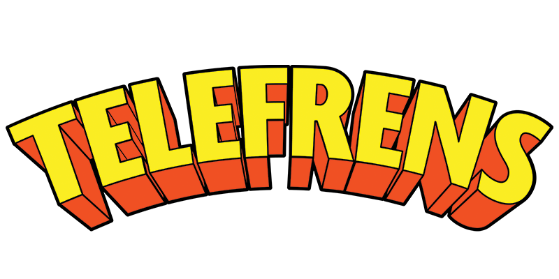
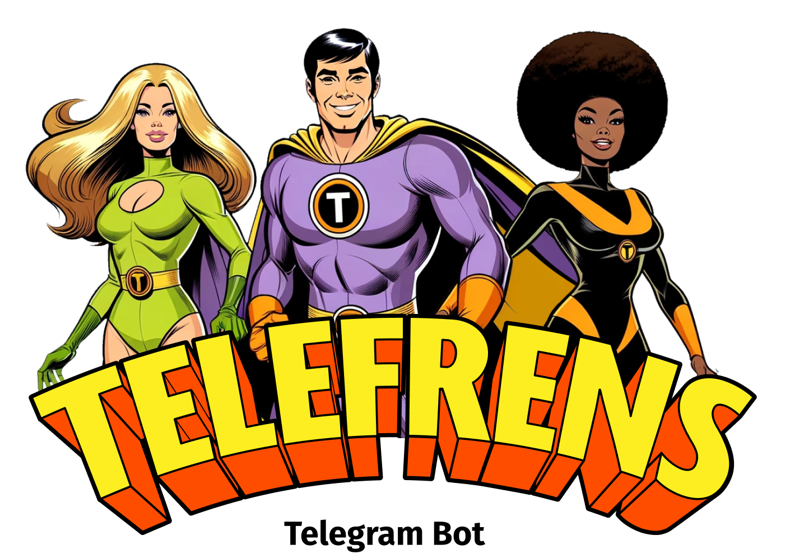
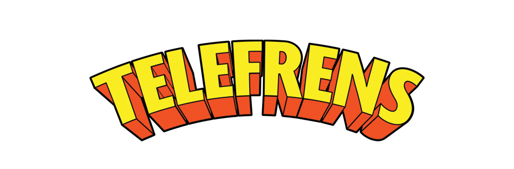
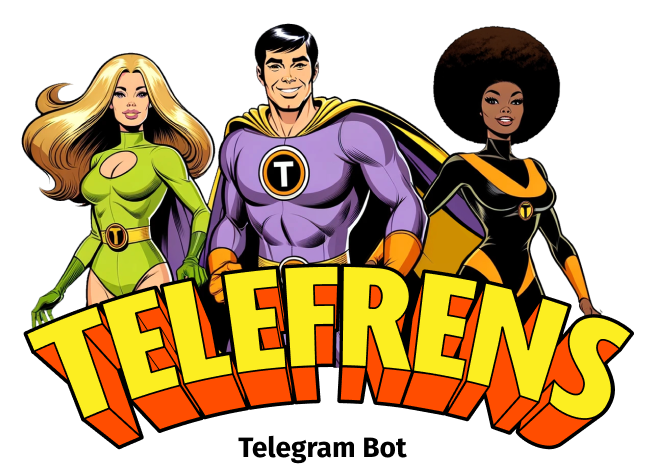
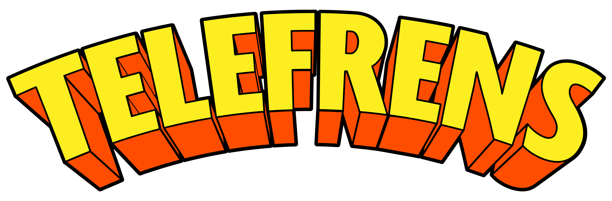
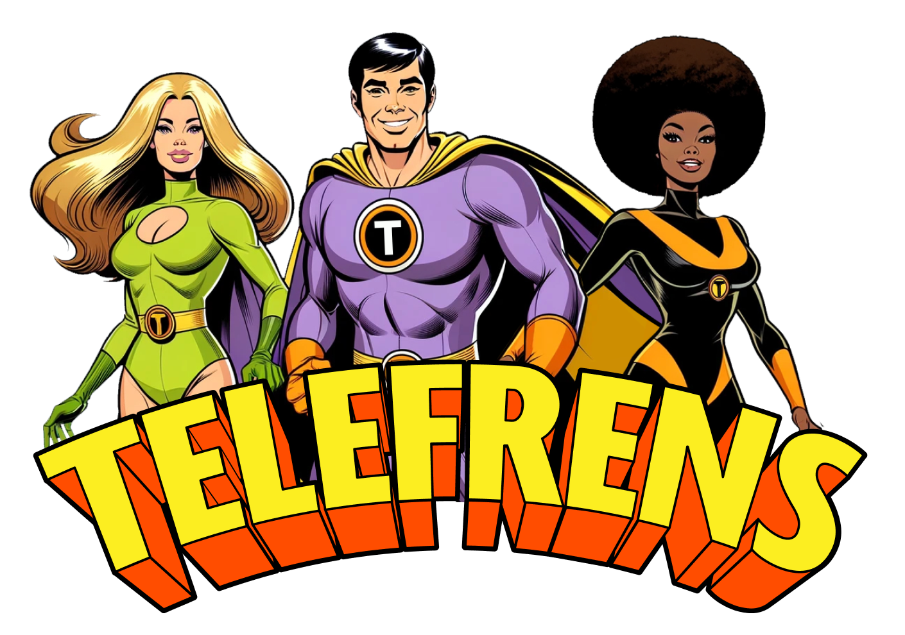

<!-- This repo uses Collab.Land as a reference https://github.com/abridged/brand-kit/tree/main
and a lot of dynamic Badges https://shields.io/docs/ -->

# Telefrens brand-kit

Brand guide and logos for the Telefrens brand.

Telefrens is the first SocialFi bot in crypto, from the team that built [Collab.Land](https://github.com/abridged/brand-kit). Get Pass access to Token Gated groups and royalties rewards for Creators on Pass transactions.

Get started with [Telefrens](https://www.telefrens.com/).

<!-- Badge row 1 - status -->

<!-- Badge row 2 - links and profiles -->

<!-- Badge row 3 - detailed status -->

### Guide

<!-- Please see [this PDF overview](guide/guide.pdf). -->

#### Font

[Fira Sans Condensed](https://fonts.google.com/specimen/Fira+Sans+Condensed)

#### Colors

- Yellow: #FCEE21

- Orange: #FF4C00

- Dark Lime green: #C7E416

- Mid lime green: #EEFD96

### Logos

| Symbol                                                                | Wordmark                                                                |
| --------------------------------------------------------------------  | ----------------------------------------------------------------------- |
|               |           |
|       |   |
|               |           |

### Heroes

| Heroes                                                      |
| ----------------------------------------------------------- |
|  |

## Branding Kit Rules & Guidelines

Thanks for your interest in your support for Telefrens! You may use any of the branding within this folder as long as you adhere to the Collab.Land [Terms of Service](https://www.collab.land/terms-of-service), and the guidelines defined below:

### What can I use this branding kit for?

- Usage of contained images within your marketing material
- Showing your support for Telefrens across social media platforms
- Creating memes

### What can't I use this branding kit for?

- You cannot use Telefrens’s logos or assets to display yourself as an employee or official representing Telefrens
- You cannot use our logos or assets for commercial purposes (i.e., merchandising)
- You may not modify the logos or assets in any way (distorting, changing colors, incorporating into your own branding, etc)
